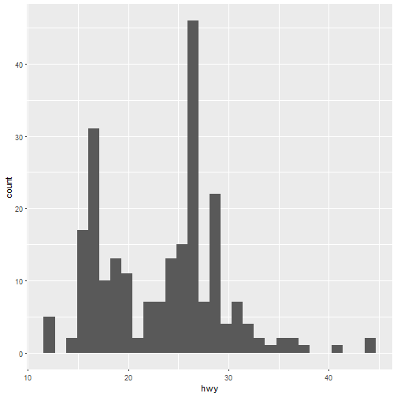
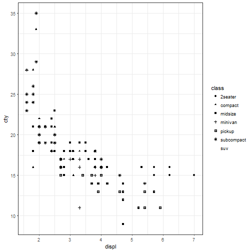

Visualization
========================================================
author: Sri Seshadri
date: 28th April 2017
autosize: true
css:custom.css

Recall material
========================================================
<br>
<br>
<br>
<p> https://github.com/srivathsesh/DataScience/tree/presentation </p>

Data Analysis process
========================================================
<!--  -->
<div class = "midcenter" style = "margin-left:300px; height:2000px">
</img>
</div>

Extraction and Transformation
========================================================
<br>
Rahul Sangole walked us through how to use <span style = "color:red"> tidyverse / dplyr <span>
* Read file into a dataframe or tibble
* Pipe (magrittr)
* mutate (dplyr) dataframe to add additional attributes to the data.

If you need recall package from Rahul's presentation, reachout to either:
- <span style = "color:blue">Priti Mane </span>
- <span style = "color:blue">Rahul Sangole </span>

Exploratory Data Analysis using R
=======================================================
- Why Code?
  + Frequently changing data
  + May save you a bunch of clicks
  + Reproducibility

- Why code in R
  + Its free (I am not rich)
  + Lots of resources out there
- Can be annoying too
  + While documentations have been standardized, it still can be a pain sometimes!
  + <span style = "color:blue">Don't worry, you still be fine </span>
 
Oh! by the way...
==========================================================
<br>
This presentation is made using <span style = "color:Red"> R </span> code 
<br>
You'll find some of the portions of the slide are not very well formatted.
<br>
Because... I still have my training wheels on

Training wheels: Google, Stackoverflow, GitHub, <span style = "color:Red"> You </span> 
 Packages
=========================================================
 <br>
 - ggplot2 (Hadley Wickham & Garrett Grolemund)
 - plotly (Plotly technologies Inc.)
 - A final surprise
 
 Datasets
 - mpg
 - mtcars
 
 ***
 
 ![book] (./Visualization-figure/cover.png)
 
How does the "mpg" data look?
========================================================
<br>

|manufacturer |model | displ| year| cyl|trans      |drv | cty| hwy|fl |class   |
|:------------|:-----|-----:|----:|---:|:----------|:---|---:|---:|:--|:-------|
|audi         |a4    |   1.8| 1999|   4|auto(l5)   |f   |  18|  29|p  |compact |
|audi         |a4    |   1.8| 1999|   4|manual(m5) |f   |  21|  29|p  |compact |
|audi         |a4    |   2.0| 2008|   4|manual(m6) |f   |  20|  31|p  |compact |
|audi         |a4    |   2.0| 2008|   4|auto(av)   |f   |  21|  30|p  |compact |
|audi         |a4    |   2.8| 1999|   6|auto(l5)   |f   |  16|  26|p  |compact |
|audi         |a4    |   2.8| 1999|   6|manual(m5) |f   |  18|  26|p  |compact |
<br>
try the command  "<span style = "color:blue">head(mpg)</span>"

What are the data types?
========================================================
<br>

```r
str(mpg)
```

```
Classes 'tbl_df', 'tbl' and 'data.frame':	234 obs. of  11 variables:
 $ manufacturer: chr  "audi" "audi" "audi" "audi" ...
 $ model       : chr  "a4" "a4" "a4" "a4" ...
 $ displ       : num  1.8 1.8 2 2 2.8 2.8 3.1 1.8 1.8 2 ...
 $ year        : int  1999 1999 2008 2008 1999 1999 2008 1999 1999 2008 ...
 $ cyl         : int  4 4 4 4 6 6 6 4 4 4 ...
 $ trans       : chr  "auto(l5)" "manual(m5)" "manual(m6)" "auto(av)" ...
 $ drv         : chr  "f" "f" "f" "f" ...
 $ cty         : int  18 21 20 21 16 18 18 18 16 20 ...
 $ hwy         : int  29 29 31 30 26 26 27 26 25 28 ...
 $ fl          : chr  "p" "p" "p" "p" ...
 $ class       : chr  "compact" "compact" "compact" "compact" ...
```

ggplot2
=======================================================

```r
#install.packages("ggplot2")
library(ggplot2)
```
(Wickham & Grolemund, 2017,p.6)

<br>
ggplot template
  - ggplot(data = <span style = "color:Red">data </span>) + <br>
    <span style = "color:Red">GEOM_FUNCTION</span>(mapping = <span style = "color:blue">aes</span>(<span style = "color:Red">MAPPINGS</span>) 
   
<i>An <span style = "color:blue">aes</span>thetic is a visual property of the objects in your plot. Aesthetics include things like size,shape or color of your points.</i>

 

Histograms
=========================================================

```r
library(ggplot2)
# What does ggplot(data = mpg) do?
ggplot(data = mpg) + geom_histogram(mapping = aes(x=hwy)) 
```


Aesthetics
=========================================================
<font size = 5>

```r
ggplot(data = mpg) + geom_histogram(mapping = aes(x=hwy),col="red", fill="red")
```


</font>

Aesthetics contd...
==========================================================
<font size = 5>

```r
ggplot(data = mpg) + geom_histogram(mapping = aes(x=hwy, fill = cyl))
```


</font>
***
<font size = 5>

```r
ggplot(data = mpg) + geom_histogram(mapping = aes(x=hwy, fill = as.factor(cyl)))
```


</font>

Move aesthetics to base layer of plot
============================================================
<font size = 5>

```r
mpg$cyl <- as.factor(mpg$cyl)
ggplot(data=mpg,aes(x=hwy,fill = cyl)) + geom_histogram() + theme_bw()
```


</font>
***
<font size = 5>

```r
library(ggplot2)
p <- ggplot(data = mpg, aes(x=hwy,fill=cyl))
p + geom_density(alpha = 0.3) + theme_classic() + labs(fill = "Cylinders", x = "Highway mpg")
```


</font>

Scatter Plots
==============================================================
<br>
<font size = 5>

```r
ggplot(data = mpg) + geom_point(mapping= aes(x = displ, y = cty, color = class)) + theme_bw()
```


</font>
***
<br>
<font size = 5>

```r
ggplot(data = mpg) + geom_point(mapping= aes(x = displ, y = cty, shape = class)) + theme_bw()
```


</font> 
<div class = "footer" style="margin-top 200px;margin-left -300px; font-size:80%;"> Google or read help about aesthetics for ggplot </div>

Scatter Plots contd...
==============================================================
<br>
<font size = 5>

```r
ggplot(data = mpg) + geom_point(mapping= aes(x = displ, y = cty)) + theme_bw() + facet_wrap(~class)
```


</font>

More than one way to skin a cat. Here is a cool way
==============================================================
<font size = 5>

```r
library(plotly)
scatter <- plot_ly(data = mpg, x = ~displ, y = ~cty, type = "scatter", color = ~class)
```
</font>
<iframe src="https://plot.ly/~srivathsesh/0/cty-vs-displ/" style="position:absolute;height:100%;width:100%"></iframe>

Boxplots
================================================================
<font size = 5>
 
 ```r
 BP <- ggplot(data = mpg,mapping = aes(x = class, y = cty))+ geom_boxplot() + coord_flip() + theme_bw() 
 BP + geom_hline(yintercept = 30, color = "red", lty = 8)
 ```
 
 
</font>

Plotly Boxplot
===============================================================
<font size = 5>

```r
library(magrittr)
PlotlyBox <- plot_ly(data = mpg, y = ~class, x = ~cty, type = "box", boxpoints = "all", color = ~class, orientation = 'h') %>% 
 add_trace(inherit = F,x = c(30,30), y = c("2seater","suv"), type = "scatter",mode = "lines", line = list(dash = 'dash',color = "red" ), showlegend = F)
```
<iframe src = "https://plot.ly/~srivathsesh/2.embed" style="position:absolute;height:100%;width:100%"></iframe>

</font>

Plots interactivity
==================================================================

```r
library(iplots)
# ihist(mtcars#mpg)
# ibar(mtcars$am)
# iplot(mtcars$mpg, mtcars$wt)
# ibox(mtcars$mpg,mtcar$cyl)
# imosaic(mtcars$am, mtcars$cyl)
# ibar(row.names(mtcars)) ; iplot.rotate(45) ; iplot.size(10,600)
# iplot.opt(col=unclass(cyl))
```

